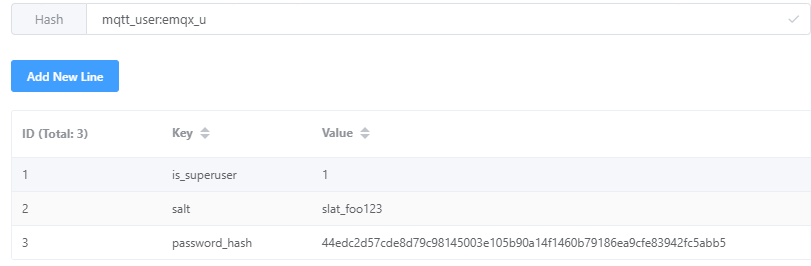

用于设备与服务器通讯的一个消息队列协议

[EMQX Official Blog](https://www.emqx.com/zh/mqtt)

[EMQX Official Docs(v5.0)](https://docs.emqx.com/zh/emqx/v5.0/)


最后使用的服务器 broker 是 EMQ X。
Client 可以下载 MQTT X。

[MQTT X](https://mqttx.app/)

EMQ X有相关的 Dashboard，会比直接在后台使用命令行方便。
Dashboard地址:  `{host}:18083`  

目前选择比较新的版本 5.6.1


## Docker Deployment

pull images

```shell
docker pull emqx/emqx
```

run container

```shell
docker run -d --name emqx \
-p 1883:1883 \
-p 8081:8081 \
-p 8083:8083 \
-p 8084:8084 \
-p 8883:8883 \
-p 18083:18083 \
-v /home/emqx/data:/opt/emqx/data \
emqx/emqx:5.6.1
```


## Spring Dependencies

maven

```xml
<dependencies>
    <dependency>
        <groupId>org.springframework.boot</groupId>
        <artifactId>spring-boot-starter-integration</artifactId>
    </dependency>
    <dependency>
        <groupId>org.springframework.integration</groupId>
        <artifactId>spring-integration-stream</artifactId>
    </dependency>
    <dependency>
        <groupId>org.springframework.integration</groupId>
        <artifactId>spring-integration-mqtt</artifactId>
    </dependency>
</dependencies>
```


## WebHook

服务器需要管理设备上下线状态。

[设备上下线-参考blog](https://blog.csdn.net/An1090239782/article/details/124817608)

先把容器中 etc/plugins/emqx_web_hook.conf copy 出来

```shell
docker cp -a emqx:/opt/emqx/etc/plugins/emqx_web_hook.conf emqx_web_hook.conf
```

编辑配置, 将上下线的打开


```conf
web.hook.url = http://localhost/service/mqtt/webhook

web.hook.rule.client.connect.1       = {"action": "on_client_connect"}
#web.hook.rule.client.connack.1       = {"action": "on_client_connack"}
#web.hook.rule.client.connected.1     = {"action": "on_client_connected"}
web.hook.rule.client.disconnected.1  = {"action": "on_client_disconnected"}
#web.hook.rule.client.subscribe.1     = {"action": "on_client_subscribe"}
#web.hook.rule.client.unsubscribe.1   = {"action": "on_client_unsubscribe"}
#web.hook.rule.session.subscribed.1   = {"action": "on_session_subscribed"}
#web.hook.rule.session.unsubscribed.1 = {"action": "on_session_unsubscribed"}
#web.hook.rule.session.terminated.1   = {"action": "on_session_terminated"}
#web.hook.rule.message.publish.1      = {"action": "on_message_publish"}
#web.hook.rule.message.delivered.1    = {"action": "on_message_delivered"}
#web.hook.rule.message.acked.1        = {"action": "on_message_acked"}

```

最后在 dashboard 中启动 webhook (暂不知道能否在配置文件中开启)

### Dashboard login username and Password(Modify)

```shell
./bin/emqx_ctl admins passwd admin 123456
```


## Security

### 1.Authentication

EMQX auth chain


#### Local intern DB config (Default，Deprecated in 5.6.1)

modify `/etc/emqx.conf`  to close

```txt
allow_anonymous = false
```

open the plugins in Dashboard


```shell
/opt/emqx/etc/plugins/emqx_auth_mnesia.conf
```

Config username and password

```text
## Password hash.
##
## Value: plain | md5 | sha | sha256 | sha512
auth.mnesia.password_hash = sha256

##--------------------------------------------------------------------
## ClientId Authentication
##--------------------------------------------------------------------

## Examples
##auth.client.1.clientid = id
##auth.client.1.password = passwd
##auth.client.2.clientid = dev:devid
##auth.client.2.password = passwd2
##auth.client.3.clientid = app:appid
##auth.client.3.password = passwd3
##auth.client.4.clientid = client~!@#$%^&*()_+
##auth.client.4.password = passwd~!@#$%^&*()_+

##--------------------------------------------------------------------
## Username Authentication
##--------------------------------------------------------------------

## Examples:
##auth.user.1.username = admin
##auth.user.1.password = public
##auth.user.2.username = feng@emqtt.io
##auth.user.2.password = public
##auth.user.3.username = name~!@#$%^&*()_+
##auth.user.3.password = pwsswd~!@#$%^&*()_+
```


#### MySQL's Authentication init SQL

MQTT user table

Refer To: `/demo-service/mysql/ddl/emqx.sql`

DB connect account (just like nacos):

```mysql
CREATE USER 'emqx'@'%' IDENTIFIED BY 'your_password_here';
# don't need to create db
GRANT ALL PRIVILEGES ON demo_db.mqtt_user TO 'emqx'@'%';
FLUSH PRIVILEGES;
```


#### Redis's Authentication init Command

```shell
HSET mqtt_user:emqx_u is_superuser 1
HSET mqtt_user:emqx_u salt slat_foo123
HSET mqtt_user:emqx_u password_hash 44edc2d57cde8d79c98145003e105b90a14f1460b79186ea9cfe83942fc5abb5
```





#### Authentication Chain Order


```
# emqx.conf

# Specific global authentication chain for all MQTT listeners
authentication = [
  ...
]

listeners.tcp.default {
  ...
  enable_authn = true
  # Specific authentication chain for the specified MQTT listener
  authentication = [
    ...
  ]
}

gateway.stomp {
  ...
  enable_authn = true
  # Specific global authenticator for all STOMP listeners
  authentication = {
    ...
  }
}
```


##  Aliyun ACK Deployment

you can use helm in ack to deploy the EMQX cluster.

1. In ack cloudshell, add hlem's emqx chats, and update it

```shell
helm repo add emqx https://repos.emqx.io/charts
helm repo update
```

```shell

helm repo add emqx https://repos.emqx.io/charts
helm repo update

helm install emqx emqx/emqx --set service.type=NodePort

kubectl apply -f emqx-acl-cm.yaml
## kubectl get cm emqx-env -o yaml > emqx-env.yaml
kubectl apply -f emqx-env.yaml

## kubectl get statefulset emqx -o yaml > emqx-statefulset.yaml
kubectl apply -f emqx-statefulset.yaml
```

emqx-acl-cm.yaml

```yaml
apiVersion: v1
kind: ConfigMap
metadata:
  name: emqx-acl-cm
  namespace: my-emqx
data:
  acl.conf: |-
    {allow, {username, {re, "^dashboard$"}}, subscribe, ["$SYS/#"]}.
    {allow, {ipaddr, "127.0.0.1"}, all, ["$SYS/#", "#"]}.
    {deny, all, subscribe, ["$SYS/#", {eq, "#"}]}.
    {allow, all}.
```