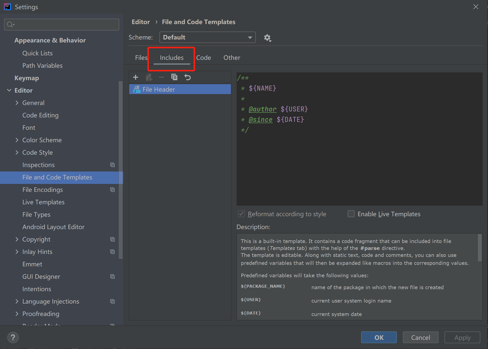
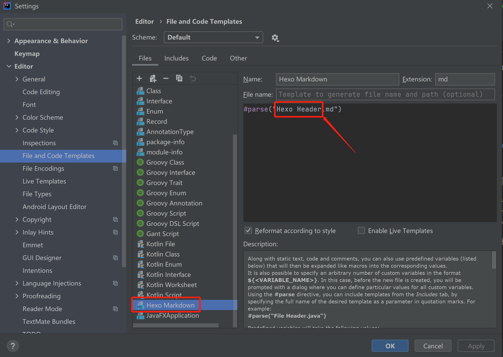
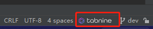

IDEA 日常使用配置

<!-- more -->

### 1.IDEA配置迁移

在 idea 中搜索(ctl+shrift+a) export setting, 可以把配置打成jar包, 然后在其他环境导入即可

### 2.SerialVersionUID 自动生成



```
Preferences->editor->Inspections, 搜索UID
```

### 3.File Header 配置

设置路径: (Preferences -> Editor -> File and Code Templates -> include)




想要定义其他文件的模板也可以, 配置对应的文件头即可 



### 3.Terminal

Setting -> Tools -> Terminal 中可以修改终端类型

### 4. Plugins



### 5. tobnine

it helps you to code easily.



