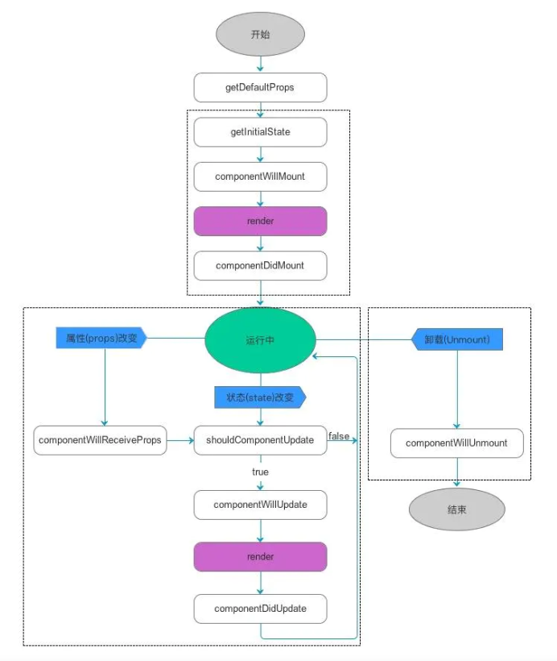

# React & Redux相关笔记
近期读书计划中有《深入React技术栈》，同时在之前的工作中也做过大概几个月的React开发，当时看了官方文档后就参与开发，有些比较好的特性又暂且没有用到。
在阅读《深入React技术栈》和查阅React & Redux官方文档之后，根据自己的理解对一些常用的知识做一下笔记。  
（暂未实战检验，后面会有项目涉及相应会修改，持续更新）...  

link:  
[react中文文档](http://caibaojian.com/react/)  
[redux中文文档](https://www.redux.org.cn/)

## 目录
- [React & Redux相关笔记](#React-&-Redux相关笔记)
    - [一.基础部分](#一.基础部分)
        - [1.数据流](#1.数据流)
        - [2.组件生命周期](#2.组件生命周期)
        - [3.refs](#3.refs)
    - [二.样式相关](#二.样式相关)
        - [1.简化样式设置](#1.简化样式设置)
        - [2.使用composes来组合样式](#2.使用composes来组合样式)
    - [三.组件间通信](#三.组件间通信)
        - [1.父组件向子组件通信](#1.父组件向子组件通信)
        - [2.子组件向父组件通信](#2.子组件向父组件通信)
        - [3.跨级组件通信(孙子组件?)](#3.跨级组件通信(孙子组件?))
        - [4.没有嵌套关系的组件通信(即是无任何关系的组件?)](#4.没有嵌套关系的组件通信(即是无任何关系的组件?))
    - [四.组件间抽象  ](#四.组件间抽象  )
        - [1.高阶组件](#1.高阶组件)
            - [1.1 CommentList 需要订阅 DataSource，用于评论渲染](#1.1-CommentList-需要订阅-DataSource，用于评论渲染)
            - [1.2 Blog 需要订阅 DataSource，用于订阅单个blog的帖子](#1.2-Blog-需要订阅-DataSource，用于订阅单个blog的帖子)
    - [五.Redux应用框架](#五.Redux应用框架)
        - [1.Redux三大原则](#1.Redux三大原则)
            - [1.1 单一数据源](#1.1-单一数据源)
            - [1.2 状态是只读的](#1.2-状态是只读的)
            - [1.3 状态修改均由纯函数完成](#1.3-状态修改均由纯函数完成)
        - [2.Redux基础组成](#2.Redux基础组成)
            - [2.1 Action](#2.1-Action)
            - [2.2 Reducer](#2.2-Reducer)
            - [2.3 store](#2.3-store)
            - [2.4 结合到react(connect函数)](#2.4-结合到react(connect函数))
        - [3.middleware](#3.middleware)
            - [3.1 middleware的实现](#3.1-middleware的实现)
            - [3.2 记录日志的例子](#3.2-记录日志的例子)
        - [4.异步处理](#4.异步处理)
            - [4.1 thunk的配置](#4.1-thunk的配置)
            - [4.2 thunk的原理](#4.2-thunk的原理)

## 一.基础部分
### 1.数据流
1.state  
2.props(组件间交互,类似参数)，propType:Js是非强类型语言,定义propTypes可以在传入非指定参数时让浏览器给出一个错误提示。  
```renderscript
static propTypes = {
	className: React.PropTypes.string,
	activeIndex: React.PropTypes.number,
	onChange: React.PropTypes.fuc,
	children: React.PropTypes.onOfType([
			React.PropTypes.arrayOf(React.PropTypes.node),
			React.PropTypes.node,
	]),
}
```
### 2.组件生命周期
对于生命周期的话，从广义上分为三个阶段：挂载、渲染、卸载。对下面这个流程图有印象就好了  
常用的几个拦截方法:   
1.componentWillMount  
2.componentDidMount  
3.componentWillReceiveProps  
4.componentWillUnmount  


### 3.refs
refs类似对象引用，它指向某个实例。某些组件接收ref，并将其向下传递给子组件。  
React中文官网的一个demo:
```
// FancyButton 使用 React.forwardRef 来获取传递给它的ref，然后转发到它渲染的DOM button中
const FancyButton = React.forwardRef((props, ref) => (
  <button ref={ref} className="FancyButton">
    {props.children}
  </button>
));

// 你可以直接获取 DOM button 的 ref：
const ref = React.createRef();
<FancyButton ref={ref}>Click me!</FancyButton>;
```

### 4.DOM
在传统的开发模式中，每次需要更新页面，都需要手动操作DOM来更新(DOM操作对性能消耗大)。  
React把真实的DOM树转化成 JavaScript对象树(Virtual DOM)。  
每次数据更新后，重新计算Virtual DOM，并和上一次生成的Virtual DOM做对比（Diff算法），对发生变化部分做批量更新（不会马上生成真实的DOM,对一些A->B,B->A的变化吗，会被优化掉）。

## 二.样式相关
### 1.简化样式设置
React为了提高开发效率，自动对px做添加，不过在多数情况下使用Css Module的方案
### 2.使用composes来组合样式
在之前的开发中，我对公用的一些样式定义了一个叫./Global.css的文件，然后个别的样式再单独定义,在使用时类似如下:  
```renderscript
/* Global.css */
.common-style {
	width: 10px;
	height: 10px;
}

/* MyStyle.css */
.normal-style {
	width: 10px;
	height: 10px;
}

import "./Global.css";
import "./MyStyle.css";
const btnA = <Button className="common-style"/>
const btnB = <Button className="normal-style"/>
```
可以发现，缺点就是明明normal中有部分与common是重复的,却得重写。  
compose就可以处理:
```renderscript
/* Global.css */
.common-style {
	/* 全局样式 */
	width: 10px;
	height: 10px;
}

/* MyStyle.css */
.base {
	/* 通用样式 */
}

.normal-style {
	composes: base;
	composes: $common-style from './Global.css';
	/* 其他样式 */
}
```

## 三.组件间通信
### 1.父组件向子组件通信
props
### 2.子组件向父组件通信 
onChange 回调
### 3.跨级组件通信(孙子组件?) 
context，前面两个都比较熟悉了，context倒是没用过，而之前是直接props一层层往里面传的，处理起来相对复杂。  
没用用到context:
```renderscript
class App extends React.Component {
  render() {
    return <Toolbar theme="dark" />;
  }
}

function Toolbar(props) {
  // Toolbar 组件接受一个额外的“theme”属性，然后传递给 ThemedButton 组件。
  // 如果应用中每一个单独的按钮都需要知道 theme 的值，这会是件很麻烦的事，
  // 因为必须将这个值层层传递所有组件。
  return (
    <div>
      <ThemedButton theme={props.theme} />
    </div>
  );
}

class ThemedButton extends React.Component {
  render() {
    return <Button theme={this.props.theme} />;
  }
}
```
用到context:
```renderscript
// Context 可以让我们无须明确地传遍每一个组件，就能将值深入传递进组件树。
// 为当前的 theme 创建一个 context（“light”为默认值）。
const ThemeContext = React.createContext('light');

class App extends React.Component {
  render() {
    // 使用一个 Provider 来将当前的 theme 传递给以下的组件树。
    // 无论多深，任何组件都能读取这个值。
    // 在这个例子中，我们将 “dark” 作为当前的值传递下去。
    return (
      <ThemeContext.Provider value="dark">
        <Toolbar />
      </ThemeContext.Provider>
    );
  }
}

// 中间的组件再也不必指明往下传递 theme 了。
function Toolbar(props) {
  return (
    <div>
      <ThemedButton />
    </div>
  );
}

class ThemedButton extends React.Component {
  // 指定 contextType 读取当前的 theme context。
  // React 会往上找到最近的 theme Provider，然后使用它的值。
  // 在这个例子中，当前的 theme 值为 “dark”。
  static contextType = ThemeContext;
  render() {
    return <Button theme={this.context} />;
  }
}
```
context类似全局变量，大部分情况下貌似不建议使用(给组件带来了外部依赖)，在一些不变的全局信息可以用(用户信息等)。  

### 4.没有嵌套关系的组件通信(即是无任何关系的组件?)
EventEmitter，借用node.js的Events模块的浏览器版实现
```renderscript
// 首先创建一个EventEmitter的单例:
import {EventEmitter} from 'events';
export defulalt new EventEmitter();

// 生产者
emitter.emitEvent('ItemChange',msg);

// 消费者
componentDidMount() {
	this.itemChange = emitter.addListener('ItemChange',(msg) => {
		// do something...
	});
}

componentWillUnmount() {
	 emitter.removeListener(this.itemChange);
}
```

## 四.组件间抽象  
### 1.高阶组件
高阶组件的用法类似一种代理的效果（设计模式的代理模式），对组件的功能进行增强。  
例如:   
1.1 CommentList 需要订阅 DataSource，用于评论渲染  
1.2 Blog 需要订阅 DataSource，用于订阅单个blog的帖子  
他们就存在共同的**行为逻辑**(如监听，取消监听，对监听事件响应)  
设为 withSubscription:
```renderscript
// 此函数接收一个组件...
function withSubscription(WrappedComponent, selectData) {
  // ...并返回另一个组件...
  return class extends React.Component {
    constructor(props) {
      super(props);
      this.handleChange = this.handleChange.bind(this);
      this.state = {
        data: selectData(DataSource, props)
      };
    }

    componentDidMount() {
      // ...负责订阅相关的操作...
      DataSource.addChangeListener(this.handleChange);
    }

    componentWillUnmount() {
      DataSource.removeChangeListener(this.handleChange);
    }

    handleChange() {
      this.setState({
        data: selectData(DataSource, this.props)
      });
    }

    render() {
      // ... 并使用新数据渲染被包装的组件!
      // 请注意，我们可能还会传递其他属性
      return <WrappedComponent data={this.state.data} {...this.props} />;
    }
  };
}
```
共同的订阅和取消订阅行为就交由 withSubscription 来处理了
```renderscript
const CommentListWithSubscription = withSubscription(
  CommentList,
  (DataSource) => DataSource.getComments()
);

const BlogPostWithSubscription = withSubscription(
  BlogPost,
  (DataSource, props) => DataSource.getBlogPost(props.id)
);
```

## 五.Redux应用框架
随着前端应用开发变得复杂，JavaScript要管理更多的state（状态）。  
管理不断变化的state非常困难。state在什么时候，由于什么原因，如何变化已不受控制。  
而Redux试图让state的变化变得可预测。

### 1.Redux三大原则
#### 1.1 单一数据源
一个对象管理，称为store，它实质上是最外层组件的state对象，然后向下传递到各组件的props中
#### 1.2 状态是只读的
只有getter，没有setter的意思咯，数据修改就交给dispatch发起
#### 1.3 状态修改均由纯函数完成
对于给定的相同输入，输出都是相同的。（Math.rand()这些就不是纯函数了）

### 2.Redux基础组成
#### 2.1 Action
action实质上就是一个js对象，约定用type字段来表示要执行的操作,如: 
```renderscript
{
    type: "DO_SOME_THING", 
    person: "someone"
}
```
#### 2.2 Reducer
reducer指定了应用状态的变化，如何响应action并发送到store的。记住action只描述了有事情发生这一事实，并未描述如何更新state。  
在我看来，redux的action更像是一个 object & do_flag ，reducer才是真正执行action的地方。  
```renderscript
// reducer实际上执行的过程
// (preState, action) => newState
(preState, action) => {
    return Object.assign({}, preState, {
        newParams: 'abcd'
    })
}
```
**2.2.1 官网文档还提示到有几个要注意到的点:**  
1.不要修改传入的参数preState(??)  
2.不执行有副作用的函数，如API请求或者路由转跳（那API请求的操作怎么处理呢？）  
3.不要调用非纯函数（符合原则）  
4.在default的情况下要返回旧的state（符合上式，应该是避免特殊情况，导致store被覆盖）  
5.除了这些之外，在开发过程中还发现，在 render() 函数中不要调用 dispatch 导致 state 的更新（组件并未绘制完成，不能调用 setState）。
    
```renderscript
// 更加详细的reducer
export default (preState, action) => {
    switch (action.type) {
        case ADD: {
            return {
                ...preState,
                value: preState.value + 1,
            };
        }
        case REDUCE: {
            return {
                ...preState,
                value: preState.value - 1,
            };
        }
        default:
            return preState;
    }
}
```  

**2.2.2 拆分reducer**  
Redux提供了一个combineReducers()工具类去组合多个reducers,对于不同独立功能reducer就可以放在不同的文件中。

#### 2.3 store
redux应用中只有一个单一的store  

**2.3.1 store的职责:**  
1.维持应用的 state  
2.提供 getState() 方法获取 state  
3.提供 dispatch(action) 方法更新 state  
4.通过 subscribe(listener) 注册监听器  
5.通过 subscribe(listener) 返回的函数注销监听器  
```renderscript
unsubsribe = subscribe(listener)
```

**2.3.2 store的配置:**  
```renderscript
// initState: 用于设置 state 初始状态
let store = createStore(reducers, initState)
```

通过redux提供的provider，嵌套在应用最外层，存放state
```renderscript
// app.js 
import {Provider} from 'redux';
import {store} from '../xxx';

function App() {
    return (
        <Privider store={store}>
            <Component/>
        <Privider/>
    );
}
```
#### 2.4 结合到react(connect函数)
Redux 的 React 绑定库是 基于**容器组件**和**展示组件**相分离 的开发思想。  

两种组件的不同点：

| |**展示组件** |**容器组件** |
|:---|:---|:---|
|**作用**|描述如何展现（骨架、样式）|描述如何运行（数据获取、状态更新）|
|**直接使用Redux**|否|是|
|**数据来源**|props|监听 Redux state|
|**数据修改**|从 props 调用回调函数|向 Redux 派发 actions|
|**调用方式**|手动|通常由 React Redux 生成|

而connect()在我看来它就是类似于利用高级组件(HOC)的设计思路，将展示组件包装成容器组件。  
将原本不依赖Redux的react展示组件，通过connect来配置一些动态的映射(mapStateToProps,mapDispatchToProps)，生成一固定的代码(store.subscribe())来简化开发。  
```renderscript
connect(mapStateToProps,mapDispatchToProps)(Component)
```
**mapStateToProps**：来指定如何把当前 Redux store state 映射到展示组件的 props 中。  
**mapDispatchToProps**：接收 dispatch() 方法并返回期望注入到展示组件的 props 中的回调方法。  

### 3.middleware
一开始是并不太理解，实际上它的作用也类似于高阶组件，但是作用于redux中(包装store的dispatch)，用于增强其功能。  

官方文档解释：middleware 是指可以被嵌入在框架**接收请求到产生响应**过程之中的代码。  
它提供的是位于 action 被发起之后，到达 reducer 之前的扩展点。   
你可以利用 Redux middleware 来进行日志记录、创建崩溃报告、调用异步接口或者路由等等。

#### 3.1 middleware的实现
middleware的实质就是通过包装store的dispatch函数来处理其 接收请求到产生响应 过程之中代码。(事实上也没那么神秘)   
其组合多个middleware的方法类似这样(实质上redux内有实现，直接Import其api即可):
```renderscript
function applyMiddleware(store, middlewares) {
  middlewares = middlewares.slice()
  middlewares.reverse()

  let dispatch = store.dispatch
  middlewares.forEach(middleware =>
    dispatch = middleware(store)(dispatch)
  )

  return Object.assign({}, store, { dispatch })
}
```

#### 3.2 记录日志的例子
目的：输出每次调用前的action和调用后的newState  
最直接的写法:
```renderscript
function dispatchAndLog(store, action) {
  console.log('dispatching', action)
  store.dispatch(action)
  console.log('next state', store.getState())
}
// 然后用 dispatchAndLog() 函数去代替store.dispatch()
```
但是每次都要导入一个外部方法总归还是不太方便。于是就直接替换掉dispatch函数。
```renderscript
let next = store.dispatch
store.dispatch = function dispatchAndLog(action) {
  console.log('dispatching', action)
  let result = next(action)
  console.log('next state', store.getState())
  return result
}
```
为了组合多个middleware，需要通过链式调用去不断包装dispatch(因为函数function在js中可以作为函数的返回值，它实际上就是一个递归封装)。  
让 middleware 以方法参数的形式接收一个 next() 方法，而不是通过 store 的实例去获取。
```renderscript
function logger(store) {
  return function wrapDispatchToAddLogging(next) {
    return function dispatchAndLog(action) {
      console.log('dispatching', action)
      let result = next(action)
      console.log('next state', store.getState())
      return result
    }
  }
}
```
结合ES6的箭头函数,实际上就是这样：
```renderscript
const logger = store => next => action => {
  console.log('dispatching', action)
  let result = next(action)
  console.log('next state', store.getState())
  return result
}
```
同理它还可能需要处理别的功能（比如说是异常获取）
```renderscript
const crashReporter = store => next => action => {
  try {
    return next(action)
  } catch (err) {
    console.error('Caught an exception!', err)
    Raven.captureException(err, {
      extra: {
        action,
        state: store.getState()
      }
    })
    throw err
  }
}
```
最后将它们引用到 Redux store 中：
```renderscript
import { createStore, combineReducers, applyMiddleware } from 'redux'


let store = createStore(
  combineReducers(reducers),
  // applyMiddleware() 告诉 createStore() 如何处理中间件
  applyMiddleware(logger, crashReporter)
```

### 4.异步处理
理解了middleware之后，redux中有一个redux-thunk库来处理异步请求。  
**thunk可以达到一些目的：**  
1.action 创建函数除了返回 action 对象外还可以返回函数。  
2.这个函数并不需要保持纯净；它还可以带有副作用，包括执行异步 API 请求。  
3.这个函数还可以 dispatch action，就像 dispatch 前面定义的同步 action 一样。  

#### 4.1 thunk的配置
跟其他中间件一样，在设置store时，放到参数中即可
```renderscript
import {thunk} from 'redux-thunk';

let store = createStore(
    combineReducers(reducers),
    initState,
    applyMiddleware(logger, crashReporter)
);
```

#### 4.2 thunk的原理
实际上thunk的原理看起来挺简单的  
1.非function,不处理，将action 传给下一个中间件  
2.function类型的action，自动触发函数，并且将store.dispatch传入  
```renderscript
function createThunkMiddleware(extraArgument) {
  return ({ dispatch, getState }) => next => action => {
    if (typeof action === 'function') {
      return action(dispatch, getState, extraArgument);
    }

    return next(action);
  };
}
```
